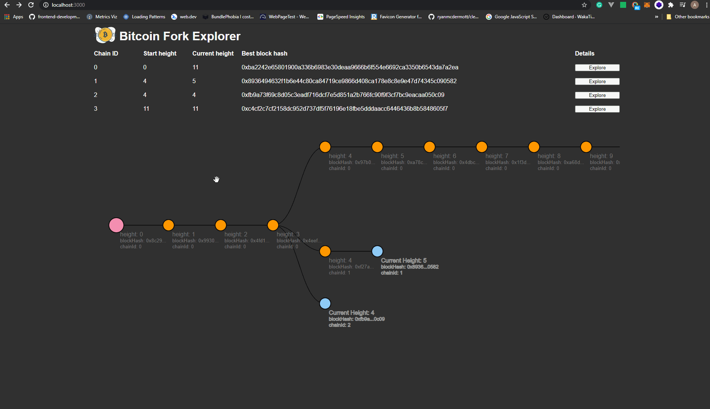

# 🚀 Project Setup & Notes

This project is a React-based frontend prototype with a focus on **scalable architecture, clean styling, and performance optimization**.  
Below are setup instructions, implementation notes, and a roadmap for improvements.  



## 🛠️ Running the Project

```bash
# install dependencies
npm install   # or yarn install

# link the relay lib to this project
npm link relay   # or yarn link

# serve with hot reload at localhost:3000
npm run start    # or yarn start
```

## 📒 Notes from Anton

### 🏗️ Project Setup

- Established the [project structure](https://dev.to/syakirurahman/react-project-structure-best-practices-for-scalable-application-18kk).

- Configured [react-router](https://github.com/ReactTraining/react-router) for multi-page routing and implemented [route-based code splitting](https://reactjs.org/docs/code-splitting.html#route-based-code-splitting) to improve performance.

- Removed [react-bootstrap](https://github.com/react-bootstrap/react-bootstrap), `bootstrap`, and `node-sass` in favor of __CSS Modules with CSS variables__, because:

  * Bundle size of `react-bootstrap` is too large for this small project ([bundlephobia](https://bundlephobia.com/result?p=react-bootstrap@1.4.3)).

  * Alternatives like [TailwindCSS](https://tailwindcss.com) or [Material UI](https://github.com/mui-org/material-ui) provide better modern solutions ([Why I don’t use Bootstrap anymore](https://dev.to/codedgar/why-i-don-t-use-bootstrap-anymore-b8)).

  * CSS Modules + variables fit well with [component composition](https://reactjs.org/docs/composition-vs-inheritance.html) ([Use CSS Variables instead of React Context](https://epicreact.dev/css-variables/)).

  * CSS preprocessors (like Sass) are generally less useful in modern React projects ([Adding a Sass Stylesheet](https://create-react-app.dev/docs/adding-a-sass-stylesheet)).

- Set up ESLint with [eslint-config-react-app](https://github.com/facebook/create-react-app/tree/master/packages/eslint-config-react-app) and [eslint-config-google](https://github.com/google/eslint-config-google), integrated with [husky](https://github.com/typicode/husky) and [lint-staged](https://github.com/okonet/lint-staged).

- Enabled __absolute imports__ for cleaner code ([Absolute imports with CRA](https://medium.com/hackernoon/absolute-imports-with-create-react-app-4c6cfb66c35d)).

### 🎨 User Experience

- Implemented __dark mode styling__.

- Accounted for __long Ethereum transaction times__ by adding loading spinners during smart contract interactions.

### ✅ TODOs (Production Roadmap)

- Apply [abort-controller](https://gist.github.com/kentcdodds/b36572b6e9227207e6c71fd80e63f3b4) for cancelable fetch requests ([Cancelling Fetch](https://academind.com/tutorials/useeffect-abort-http-requests/#cancelling-fetch)).

- Write __unit and integration tests__ against the smart contract.

- Set up [webpack-bundle-analyzer](https://github.com/webpack-contrib/webpack-bundle-analyzer) to monitor bundle size.

- Configure [Lighthouse CI](https://github.com/GoogleChrome/lighthouse-ci) for automated web performance monitoring.

- Add a __cross-browser compatible favicon__ via [RealFaviconGenerator](https://realfavicongenerator.net/).

- Introduce [xstate](https://github.com/davidkpiano/xstate) for finite state management ([Stop using isLoading booleans](https://kentcdodds.com/blog/stop-using-isloading-booleans)).

- Consider __state management & caching__ with [React Context](https://reactjs.org/docs/context.html) + [react-query](https://github.com/tannerlinsley/react-query), [Apollo Client](https://github.com/apollographql/apollo-client), or [SWR](https://github.com/vercel/swr).

  * References: [Why I Stopped Using Redux](https://dev.to/g_abud/why-i-quit-redux-1knl), [My State Management Mistake](https://epicreact.dev/my-state-management-mistake).

- Add __Skeleton UI screens__ for smoother UX ([Implementing Skeleton Screens in React](https://www.smashingmagazine.com/2020/04/skeleton-screens-react/)).

- Use [quicklink](https://github.com/GoogleChromeLabs/quicklink) for prefetching when scaling to multiple pages.

- Configure __social media meta tags__ for better link previews across platforms.

- Additional ideas: [Anton’s TODO gist](https://gist.github.com/anton-karlovskiy/44d143bb7be5e03bf1db53d54f4874fa).

### 🎯 Purpose

This repository demonstrates __best practices for React frontend development__ with an emphasis on:

- Scalable architecture

- Lightweight styling without unnecessary dependencies

- Performance optimization

- Web3 integration awareness (Ethereum transactions)

## 📄 License

MIT — Free to use, modify, and share.